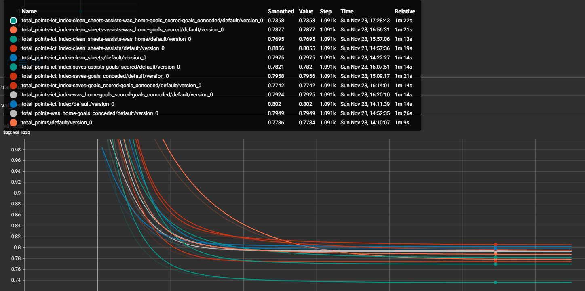
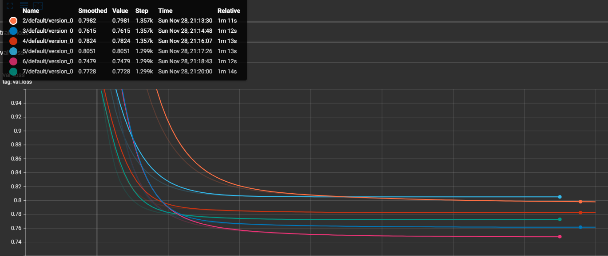
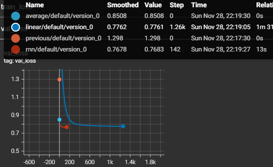

# Goal
Compare different model types, feature sets and window sizes

## Things to do 
- Compare different feature sets
    - Does adding was_home feature help ?
- Compare different window sizes
    - Is 4 the optimal window size
- Compare different models
    - Linear model vs RNN 
- Does dynamic augmentation help ?

### How to model comparison with pytorch lightning
- Current workflow
    - I want to test performance of my model on a few different feature sets and visualize losses of different features on the same plot in tensorboard.
    ```
    class LightningWrapper(pl.LightningModule):
        def__init__(self, features):
            self.features = features 

        def training_step(self, batch, batch_idx):
            ....
            .....
            self.logger.experiment.add_scalars("version_0", { f"{self.features}" : loss})

    for feature_set in potential_feature_sets:
        trainer = pl.Trainer(logger=f'feature_comparison/{feature_set}')
        model = LightningWrapper(feature_set)
        trainer.fit(model)
    ```
- I decided to iterate over powerset of relevant features and identify feature set with best loss on validation test. Went for brute force over all subsets because I only have 10 features. A wiser engineer would probably use better methods. 


# Results
- Feature comparison results 
    - To repeat experiment run `python agent.py --feature_comparison True --run_E2E_agent False --epochs 100`
    - Results are under `lightning_logs/feature_comparison/`
    - Image below shows validation losses for different feature sets. 
        - Best feature set was `total_points-ict_index-clean_sheets-assists-was_home-goals_scored-goals_conceded`
    
- Window comparison results
    - To repeat experiment run `python agent.py --window_comparison True --run_E2E_agent False --epochs 100`
    - Results are under `lightning_logs/window_comparison/`
    - Image below shows validation losses for different window sizes
        - Best feature set was `total_points-ict_index-clean_sheets-assists-was_home-goals_scored-goals_conceded`
    
- Model comparison
    - To repeat experiment run `python agent.py --model_comparison True --run_E2E_agent False --epochs 100`
    - Results are under `lightning_logs/model_comparison/`
    - Rnn seems to learn fast, but only is better than linear model by 1%. 
    